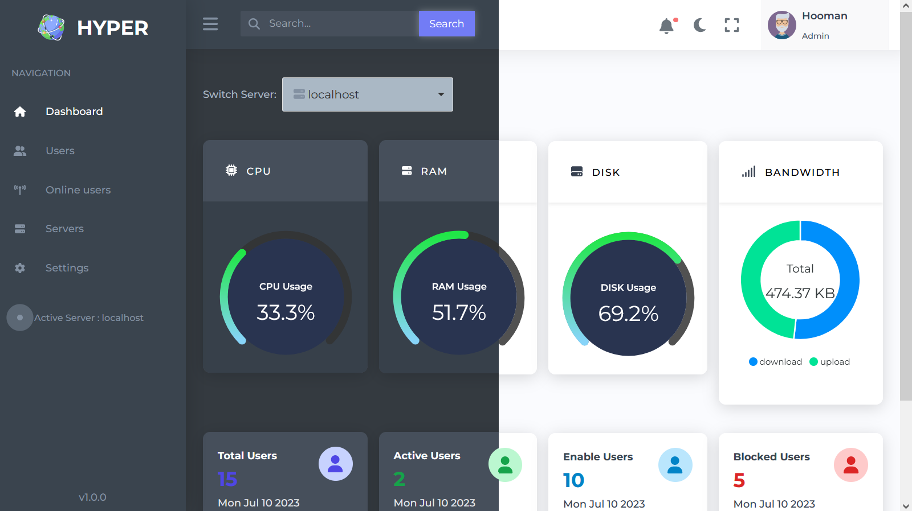
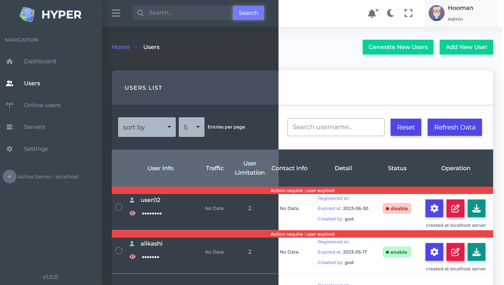
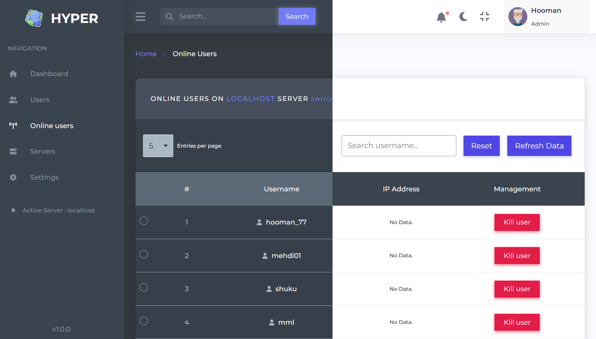
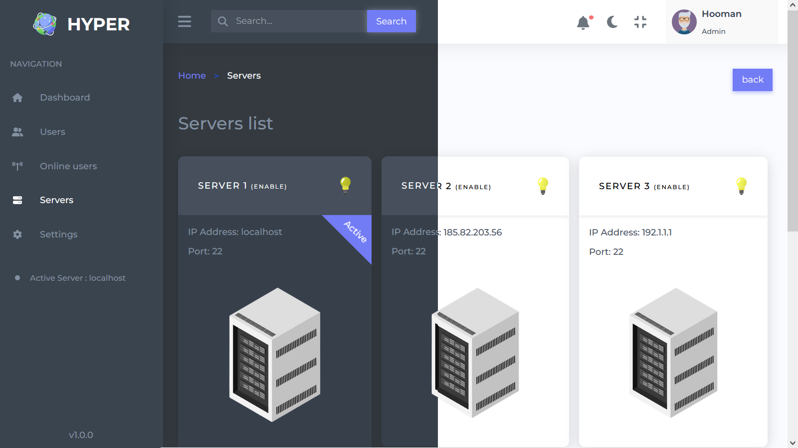
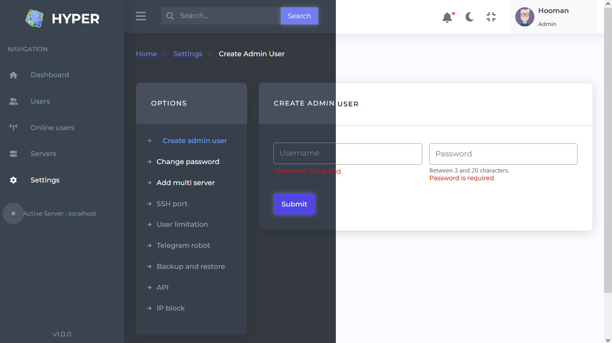

<h1 style="display: flex;align-items: center; gap:1rem"> Hyper Admin Panel </h1>  
<a href='https://github.com/hoomanFsmo77/Hyper-admin-panel/tree/master/frontend' target="_blank"></a>

## Tech

<a href='https://vuejs.org/' target="_blank"></a>   <a href='https://router.vuejs.org/' target="_blank"></a>    <a href='https://pinia.vuejs.org/' target="_blank"></a> <a href='https://tailwindcss.com/' target="_blank"></a> <a href='https://apexcharts.com' target="_blank"></a> <a href='https://fontawesome.com/' target="_blank"></a> <a href='https://www.typescriptlang.org/' target="_blank"></a>  <a href='https://webpack.js.org/' target="_blank"></a> <a href='https://formkit.com/' target="_blank"></a>

## Preview

### Panel contains 4 main pages
#### 1- Dashboard
##### in this page as you can see is server and client status are live visible that is programmed by web socket.


#### 2- Users

##### this page belongs to users and its operation. You are able to 1- change the password 2- renew expired user 30  3- lock/unlock user 4- download user detail in text file 5- edit user detail 6- generate several user 7- create single user


#### 3- Online users
##### in this page is shown the status of online user, which you can disconnect their connection.


#### 4- Servers
##### in this page you can see the available servers which you are able to switch between them.


#### 5- Settings
##### as you can see there are plenty of options for admins to control admin panel.


## Project structure

```
├── tailwind.config.js => tailwind class configs
├── colors.ts => project color palates
├── index.html
├── webpack.dev.config.ts => webpack config for development
├── webpack.prod.config.ts => webpack config for production
├── tsconfig.json => typescript config
├── postcss.config.js => postcss config for tailwind and bundling
├── formkit.config.ts => formkit plugins
├── .d.ts => typescript decleration
├── .babelrc => using babelrc for transfering js high level ecmascript code to low level for better proformance on older browser
├── package.json
├── package-lock.json
├── README.md
└── src
    ├── app.ts  => entry point file for webpack and packages
    ├── App.vue  => entry point vue component
    ├── router.ts  => page routing configs
    ├── shims-vue.d.ts => typescript decleration file for vue components
    └── utils
        ├── Data.ts => tabs data
        ├── Helper.ts => some helper function
        └── Types.ts  => interfaces
    └── store
        ├── auth.ts => authentication store for saving user token and username
        ├── dashboard.ts
        └── table.ts
    └── public => images and assets
    └── plugins => vue plugin
    └── pages => all pages component
    └── layout => repeatable sections in pages put in layout components
    └── directive => some vue directives
    └── composables => logic of the app
    └── components
    └── assets  => all styles place here
```

## Setup for developing project

Make sure to install the dependencies:

```bash
# yarn
yarn install

# npm
npm install

# pnpm
pnpm install
```
#### Then you need to create a .env.production file name (for building project) and .env.development file name (for developing project) file in root of the project and add these keys and your values

| Key            | Type     | Description                                                                   |
|:---------------| :------- |:------------------------------------------------------------------------------|
| `APP_API_BASE` | `string` | **Required**. Api Url format: https://example.com/  |

## Development Server

Start the development server on `http://localhost:3000`

```bash
npm run dev
```

## Production

Build the application for production:

```bash
npm run build
```
